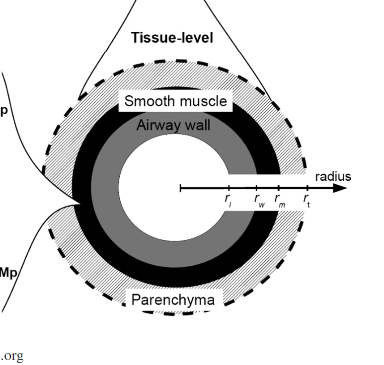

1. What kind of the problems we will solve?

A general simulation from https://github.com/febiosoftware/FEBio/blob/develop/FECore/FEModel.cpp:

hyperelastc material: neo-hookean method using fem,

in febio, they use: 
https://www.sciencedirect.com/science/article/pii/S1751616118313055

And there are several other params in different situations:
https://pmc.ncbi.nlm.nih.gov/articles/PMC9577367/pdf/fphys-13-984286.pdf
ashma: https://journals.physiology.org/doi/epdf/10.1152/japplphysiol.01289.2010

1. any other force? like boundary condition

3. Any mesh samples? 
Not good：https://huggingface.co/spaces/Wuvin/Unique3D

# Fem
A FEM/FVM Framework from slides 8: https://games-cn.org/games103-slides/

$$
\begin{aligned}
& \mathbf{D}_{\mathrm{m}}=\left[\begin{array}{lll}
\mathbf{X}_{10} & \mathbf{X}_{20} & \mathbf{X}_{30}
\end{array}\right] \\
& \mathbf{F}=\left[\begin{array}{lll}
\mathbf{x}_{10} & \mathbf{x}_{20} & \mathbf{x}_{30}
\end{array}\right] \mathbf{D}_{\mathrm{m}}^{-1} \\
& {\left[\begin{array}{lll}
\mathbf{U} & \Lambda & \mathbf{V}^{\mathrm{T}}
\end{array}\right]=\operatorname{svd}(\mathbf{F})} \\
& \mathbf{P}=\operatorname{Udiag}\left(\frac{\partial W}{\partial \lambda_0}, \frac{\partial W}{\partial \lambda_1}, \frac{\partial W}{\partial \lambda_2}\right) \mathbf{V}^{\mathrm{T}} \\
& {\left[\begin{array}{lll}
\mathbf{f}_1 & \mathbf{f}_2 & \mathbf{f}_3
\end{array}\right]=-\frac{1}{6 \operatorname{det}\left(\mathbf{D}_{\mathrm{m}}^{-1}\right)} \mathbf{P D}_{\mathrm{m}}^{-\mathrm{T}}} \\
& \mathbf{f}_0=-\mathbf{f}_1-\mathbf{f}_2-\mathbf{f}_3
\end{aligned}
$$

1. Constructing the Reference Geometry

First, define the geometry of the element in the reference. For example, in a tetrahedral element, let the nodal positions be $\mathbf{X}_0, \mathbf{X}_1, \mathbf{X}_2, \mathbf{X}_3$. We form the edge matrix (often denoted as the material matrix):

$$
\mathbf{D}_m=\left[\begin{array}{lll}
\mathbf{X}_{10} & \mathbf{X}_{20} & \mathbf{X}_{30}
\end{array}\right], \quad \text { with } \mathbf{X}_{i 0}=\mathbf{X}_i-\mathbf{X}_0
$$

This matrix is the element's initial shape and its determinant is related to the element's volume (or area in 2D).

2. Computing the Deformation Gradient

When the element deforms, the current nodal positions become $\mathbf{x}_0, \mathbf{x}_1, \mathbf{x}_2, \mathbf{x}_3$. The current edge vectors are:

$$
\mathbf{x}_{i 0}=\mathbf{x}_i-\mathbf{x}_0 .
$$

The deformation gradient $\mathbf{F}$ is then given by:

$$
\mathbf{F}=\left[\begin{array}{lll}
\mathbf{x}_{10} & \mathbf{x}_{20} & \mathbf{x}_{30}
\end{array}\right] \mathbf{D}_m^{-1} .
$$

This tensor $\mathbf{F} \in \mathbb{R}^{3 \times 3}$ maps differential vectors in the reference configuration to the current configuration.

3. SVD Decomposition to Extract Principal Stretches

Perform a singular value decomposition (SVD) of $\mathbf{F}$ :

$$
\mathbf{F}=\mathbf{U} \boldsymbol{\Sigma} \mathbf{V}^T
$$

where $\boldsymbol{\Sigma}=\operatorname{diag}\left(\lambda_0, \lambda_1, \lambda_2\right)$.
- $\lambda_i$ are the principal stretches.
- $\mathbf{U}$ and $\mathbf{V}$ are orthogonal matrices representing rotations in the current and reference configurations, respectively.

This decomposition separates the deformation into a pure stretch (captured by the $\lambda_i$ ) and rotations, making it convenient to express hyperelastic energy functions.

4. Birzle's Material Energy Function

Birzle's model for lung tissue is expressed in terms of strain invariants or, equivalently, in terms of the principal stretches. For example, if the energy density is given by

$$
W=W\left(I_1, I_3\right)
$$

with

$$
I_1=\lambda_0^2+\lambda_1^2+\lambda_2^2, \quad I_3=\lambda_0^2 \lambda_1^2 \lambda_2^2
$$

then we can express $W$ directly as a function of $\lambda_i$. The energy function typically includes material parameters such as $c_1, c_3, d_1$, and $d_3$ (along with relations to Young's modulus $E$ and Poisson's ratio $\nu$ ). This energy function is designed to capture the nonlinear and possibly compressible behavior of lung parenchyma during breathing.

5. Deriving the Stress from the Energy Function

The first Piola-Kirchhoff stress tensor $\mathbf{P}$ is defined as the derivative of the strain energy density with respect to the deformation gradient:

$$
\mathbf{P}=\frac{\partial W}{\partial \mathbf{F}}
$$

When the energy is expressed in terms of the principal stretches, we can use the chain rule along with the SVD:

$$
\mathbf{P}=\mathbf{U} \operatorname{diag}\left(\frac{\partial W}{\partial \lambda_0}, \frac{\partial W}{\partial \lambda_1}, \frac{\partial W}{\partial \lambda_2}\right) \mathbf{V}^T
$$

Here, $\frac{\partial W}{\partial \lambda_i}$ are computed by differentiating the Birzle energy function (expressed in terms of $I_1$ and $I_3$, which themselves are functions of the $\lambda_i$ ).

6. Computing Nodal Forces (FEM/FVM Integration)

Once we have $\mathbf{P}$, we compute the element's internal nodal force vector. According to the provided framework:

$$
\left[\begin{array}{lll}
\mathbf{f}_1 & \mathbf{f}_2 & \mathbf{f}_3
\end{array}\right]=-\frac{1}{6 \operatorname{det}\left(\mathbf{D}_m^{-1}\right)} \mathbf{P} \mathbf{D}_m^{-T}
$$

and the force at node 0 is

$$
\mathbf{f}_0=-\mathbf{f}_1-\mathbf{f}_2-\mathbf{f}_3
$$

This formula projects the stress tensor into nodal forces using the geometry of the reference element (encoded in $\mathbf{D}_m$ ).

7. Assembling the Global System and the Hessian

For nonlinear analysis (or implicit time integration), we also need the tangent stiffness matrix (the Hessian of the total energy):

$$
\mathbf{K}=\frac{\partial^2 E}{\partial \mathbf{x}^2}
$$

Using the chain rule,  differentiate the internal force with respect to nodal displacements. The slides provide an SVD-based approach to compute the derivatives of $\mathbf{P}$ with respect to $\mathbf{F}$, accounting for derivatives of $\mathbf{U}, \boldsymbol{\Sigma}$, and $\mathbf{V}$. Although the derivation is lengthy, the key steps are:
1. Differentiate $W$ with respect to each $\lambda_i$ (obtaining $\frac{\partial W}{\partial \lambda_i}$ ) and compute the second derivatives $\frac{\partial^2 W}{\partial \lambda_i \partial \lambda_j}$.
2. Use the SVD derivatives (as given in the slides) to propagate these derivatives back to obtain $\frac{\partial \mathbf{P}}{\partial \mathbf{F}}$.
3. Finally, relate the derivative of $\mathbf{P}$ with respect to $\mathbf{F}$ to the derivative of the nodal forces with respect to nodal displacements.

This Hessian is then assembled element-wise into the global stiffness matrix used in a Newton-Raphson iteration to solve the nonlinear equilibrium equations.

8. Solving the Nonlinear System

Once we have assembled the global residual vector (difference between internal and external forces) and the global stiffness matrix, we solve the nonlinear system using an implicit method (e.g., backward Euler for dynamics) along with Newton-Raphson iteration or some other optimization method:

$$
\begin{gathered}
\mathbf{K}\left(\mathbf{x}^{(k)}\right) \Delta \mathbf{x}^{(k)}=-\mathbf{r}\left(\mathbf{x}^{(k)}\right), \\
\mathbf{x}^{(k+1)}=\mathbf{x}^{(k)}+\Delta \mathbf{x}^{(k)}
\end{gathered}
$$

At every iteration, update $\mathbf{F}$ (via the current displacements), perform SVD, compute the stress $\mathbf{P}$ using Birzle's energy function, update the residual and Hessian, and solve for the nodal displacement increment.